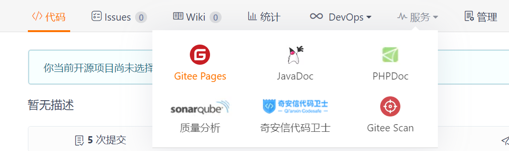
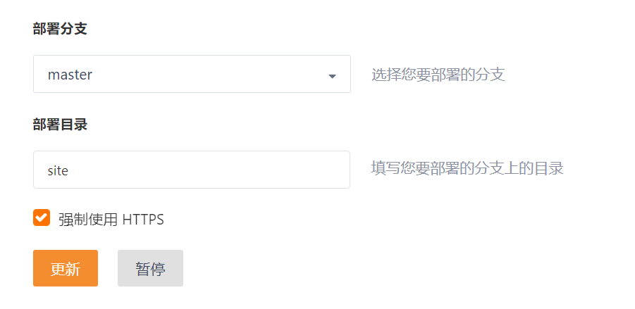
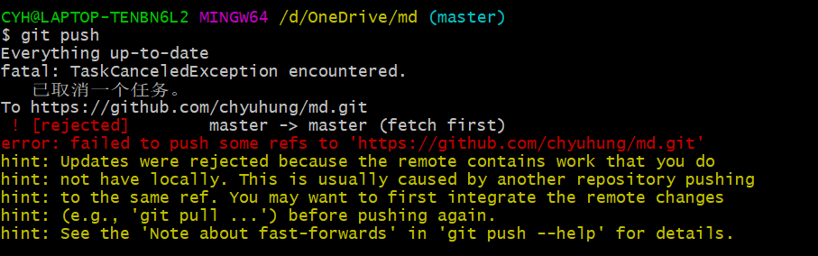
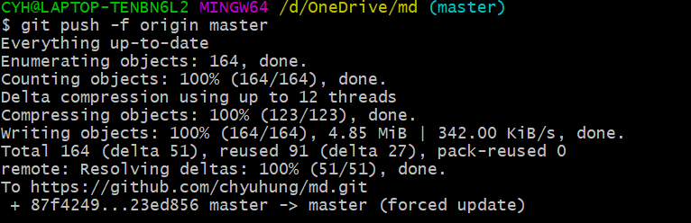

# 同步mkdocs到多个git远程仓库

## 本地环境

1、下载安装[python](https://www.python.org/);

2、下载安装[git](https://git-scm.com/download/win);

3、安装[Material for MkDocs](https://squidfunk.github.io/mkdocs-material/)，命令行执行`pip install mkdocs-material`

## 关键配置

### pages服务

1、gitee需要开启pages服务，且每次push代码以后需要进行手动重新部署

2、gitee的pages不支持`mkdocs  gh-deploy`一键部署，需选择提交代码的分支下的site目录进行手动部署

### git config配置

1、配置好一个仓库以后，使用命令`vi .git/config`编辑git配置文件，在*[remote "origin"]*下添加新的仓库地址

`[remote "origin"]`

`url = https://gitee.com/chyuhung/md.git`

`url = https://github.com/chyuhung/md.git`

`fetch = +refs/heads/*:refs/remotes/origin/*`

### push到仓库

1、使用以下命令push代码，首次会提示登录github或gitee，输入账号密码登录即可，如果输入错误，可到*控制面板>用户账户>凭据管理器*中修改

`git add .` 

`git commit -m "github & gitee 同步推送和分发"` 

`git push`

2、push代码时可能出现类似以下的错误，可以添加参数`-f`强制push

