# falsk入门

## flask项目创建

克隆github上flask项目文件到本地：

`git clone https://github.com/greyli/helloflask.git`
`cd helloflask`

也可以在github点击该项目fork后，在复制自己项目地址：

`git clone https://github.com/chyuhung/helloflask.git`

## 开发环境搭建

### 需要安装的包

1、安装python，使用3.6及以上版本；

2、安装python包管理工具pip，可以使用`pip --version`命令查看已经安装的版本，安装后如需安装需要的其他包，可以使用命令`pip install [包名]`方便快速的进行安装；

3、安装pipenv，它是基于pip的python包管理工具，用法与pip相似，可以看作pip加强版，它解决了pip+virtualenv+requirements.txt的工作方式弊端，可以说它是pip、Pipfile、Virtualenv的结合体，安装完pip以后，使用命令`pip install pipenv`进行安装，使用命令`pipenv --version`查看安装的版本。

### 创建虚拟环境

1、进入项目目录，使用命令`pipenv install`即可为当前项目创建虚拟环境，它会创建“项目目录名+随机字符”的文件夹，并且安装pip，wheel、setuptools等基本的包，flask示例项目中包含Pipfile文件，文件中列出的包也会一并安装；

2、安装完成后，使用命令`pipenv shell`激活虚拟环境，使用`pipenv run`命令，如：`pipenv run python hello.py`则不需要关心是否激活了虚拟环境；

3、依赖管理：一个程序通常会使用很多的Python包，即依赖(dependency)。而程序不仅仅会在一台电脑上运行，程序部署上线时需要安装到远程服务器上，为了能顺利运行程序，不得不记下所有依赖包，然后使用pip或Pipenv安装，这些重复无用的工作当然应该避免。在以前通常使用pip搭配一个requirements.txt文件来记录依赖。但requirements.txt需要手动维护，在使用上不够灵活。Pipfile的出现就是为了替代难于管理的requirements.txt。在创建虚拟环境时，如果项目根目录下没有Pipfile文件，pipenv install命令还会在项目文件夹根目录下创建Pipfile和Pipfile.lock文件，前者用来记录项目依赖包列表，而后者记录了固定版本的详细依赖包列表。当我们使用Pipenv安装/删除/更新依赖包时，Pipfile以及Pipfile.lock会自动更新。

### 安装flask

使用命令`pipenv install flask`在项目文件夹下安装flask，pipenv能够自动管理虚拟环境，使用pipenv命令安装的包都在虚拟环境中，而需要在全局环境下安装包等才使用pip命令。

安装Flask会默认同时安装Flask依赖包。

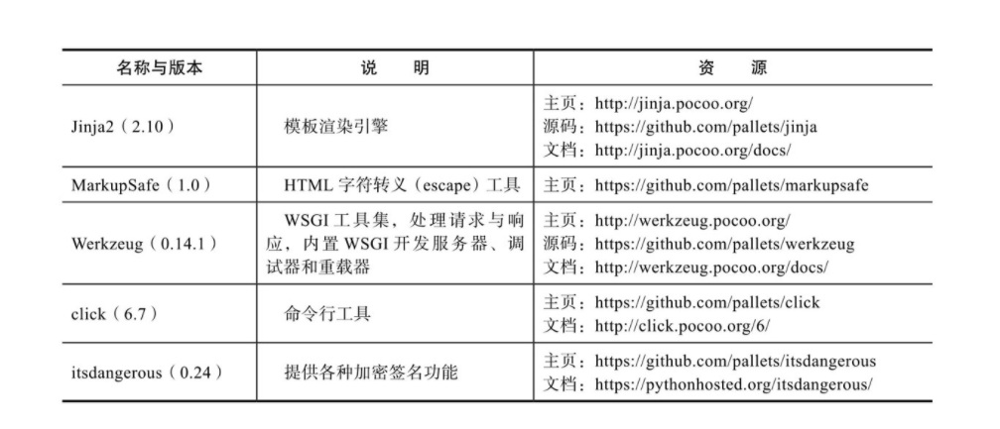

### 开发环境

使用Pycharm打开项目文件夹能够自动识别虚拟环境，再进行简单的配置即可。

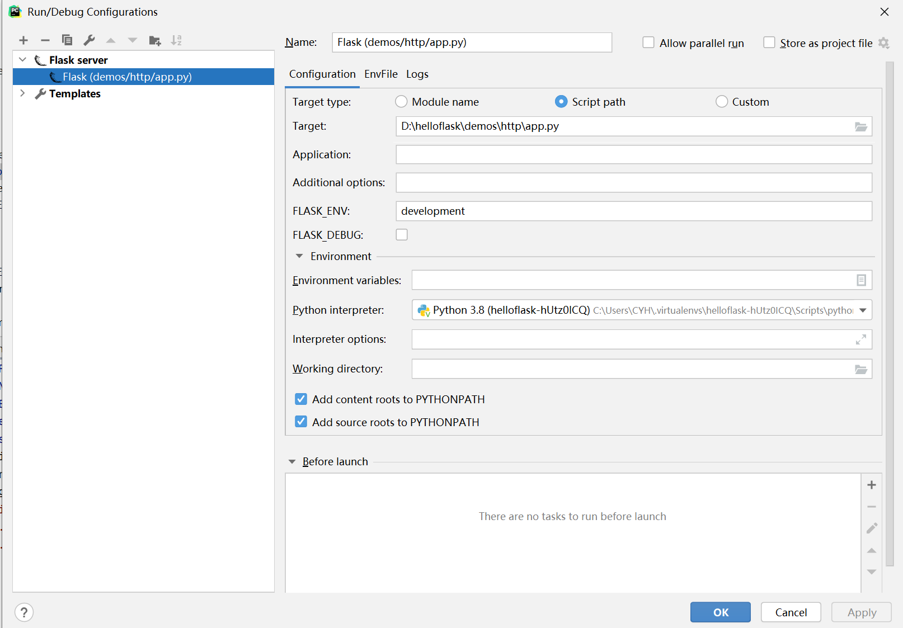

## 最小Flask程序

项目程序目录，示例代码为hello小程序。

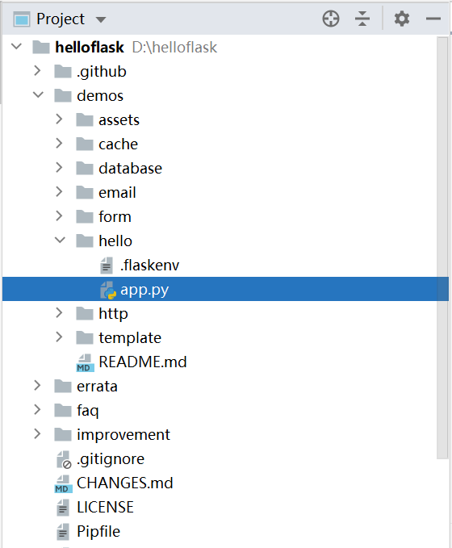

app.py代码，一般简单程序命令使用app.py，也可以自定义，避免使用flask.py，会与Flask本身冲突。

```python
from flask import Flask
app = Flask(__name__)
@app.route('/')
def index():
	return '<h1>Hello Flask!</h1>'
```

传入Flask构造方法的第一个参数是模块或包名称，使用特殊变量`__name__`，python能够根据所处模块自动赋值到`__name__`，对app.py这个程序来说，值为app。

### 注册路由

在这个程序里，app.route()装饰器把根地址/和index()函数绑定起来，当用户访问这个URL时就会触发index()函数。

在一个Web应用里，客户端和服务器上的Flask程序的交互可以简单概括为以下几步：
1）用户在浏览器输入URL访问某个资源。
2）Flask接收用户请求并分析请求的URL。
3）为这个URL找到对应的处理函数。
4）执行函数并生成响应，返回给浏览器。
5）浏览器接收并解析响应，将信息显示在页面中。

### URL

绑定多个URL到视图：

```python
@app. route('/hi')
@app.route('/hello')
def say_hello():
return '<h1>Hello，Flask !</h1>'
```

动态URL

即在URL中添加变量，使用“<变量名>”的形式表示，Flask处理请求时会把变量传入视图函数。

```
#test
@app.route('/hi/<new_name>')
def hi_new_name(new_name):
    response='<h1>hi,%s</h1>'%new_name
    return  response
```

URL中包含变量，则将传入视图函数的字符串称为URL规则，Flask将请求URL和URL规则匹配，如示例代码，/hi/peter，/hi/bob等请求都能够触发这个视图函数。

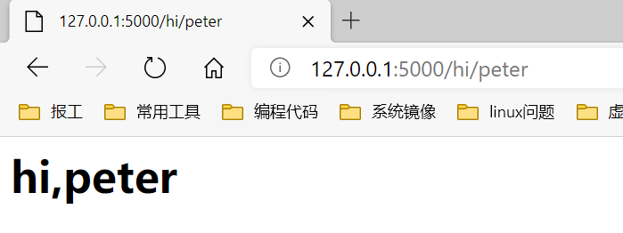

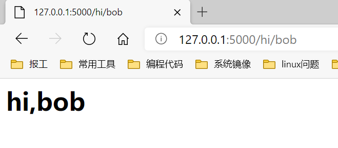

当URL中包含变量，如果用户访问的URL中没有变量，如/hi，Flask在匹配失败后会返回404错误。

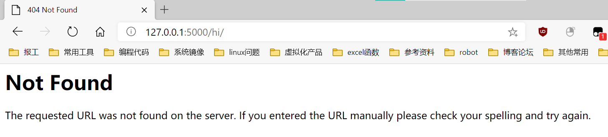

常见的做法时在app.route()装饰器中使用deefaults参数设置URL变量的默认值，该参数接收字典作为输入，存储URL变量和默认值的映射。

```
#test
@app.route('/hi/',defaults={'new_name':'chyuhung'})
def hi_new_name(new_name):
    response='<h1>hi,%s</h1>'%new_name
    return  response
```

设置默认值new_name为“chyuhung”。

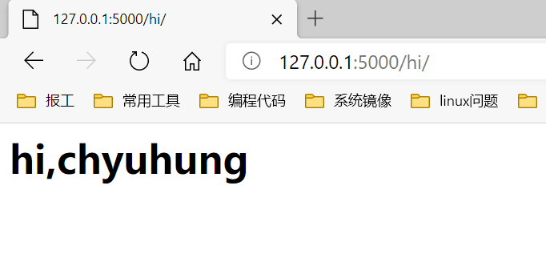

### URL与端点

Web程序中，URL无处不在，如果程序中URL都以硬编码方式写出，将会大大降低代码易用性。当修改了某个URL规则，程序对应的URL都要一个个进行修改，更好的方法时使用Flask提供的usr_for()函数获取URL，当路由定义中的URL规则被修改时，这个函数能够返回正确的URL。

```
#test01
@app.route('/test01')
def test01():
    url=url_for('test01')
    response = "hello,test01!url is %s"%url
    return response
```

这个路由的端点即视图函数的名称test01，调用url_for('test01')即可获取对应的URL，即“/test01”。

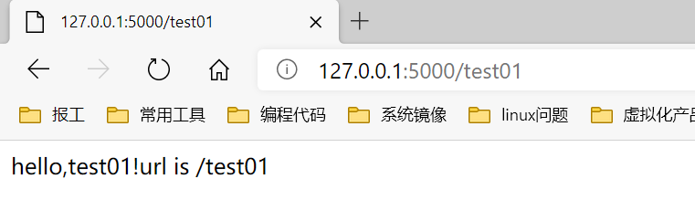

如果URL含有动态部分，在url_for()函数里也需要传入相应的参数。

```
#test01
@app.route('/test01/<test_num>')
def test01(test_num):
    url=url_for('test01',test_num='01')
    response = "hello,test01!url is %s"%url
    return response
```

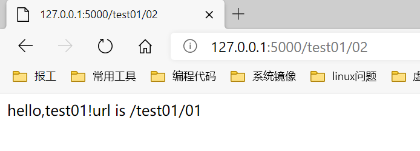

使用url_for()函数生成的URL是相对URL(即内部URL)，即URL中的path部分，比如“/hello”，不包含根URL。相对URL只能在程序内部使用。如果想要生成供外部使用的绝对URL，可以在使用url_for()函数时，将_external参数设为True，这会生成完整的URL。

### Flask命令

通过创建任意一个函数，并为其添加app.cli.command()装饰器，我们就可以注册一个flask命令。

```
#自定义命令
@app.cli.command()
def test():
    click.echo('this is a test')
```

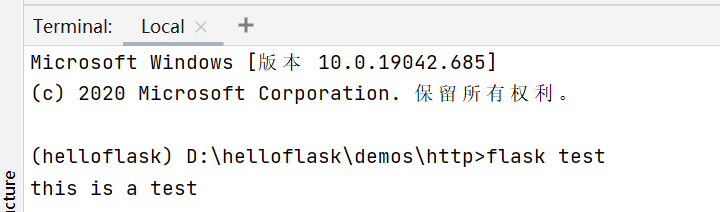

函数的名称即为命令名称，这里注册的命令即test，使用flask test命令来触发函数。作为替代，可以在app.cli.command()装饰器中传入参数来设置命令名称，比如app.cli.command('hello')会把命令名称设置为hello，完整的命令即flask hello。

```
#自定义命令
@app.cli.command('hello')
def test():
    click.echo('this is a test')
```

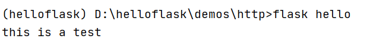

此外，借助click模块的echo()函数，可以在命令行界面输出字符。

### 模板与静态文件

一个完整的网站当然不能只返回用户一句“Hello,World!”，需要模板(template)和静态文件(static file）来生成更加丰富的网页。模板即包含程序页面的HTML文件，静态文件则是需要在HTML文件中加载的CSS和Java Script文件，以及图片、字体文件等资源文件。默认情况下，模板文件存放在项目根目录中的templates文件夹中，静态文件存放在static文件夹下，这两个文件夹需要和包含程序实例的模块处于同一个目录下，对应的项目结构示例如下所示：

```
hello/
- templates/
- static/
- app.py
```

  

## Flask与http

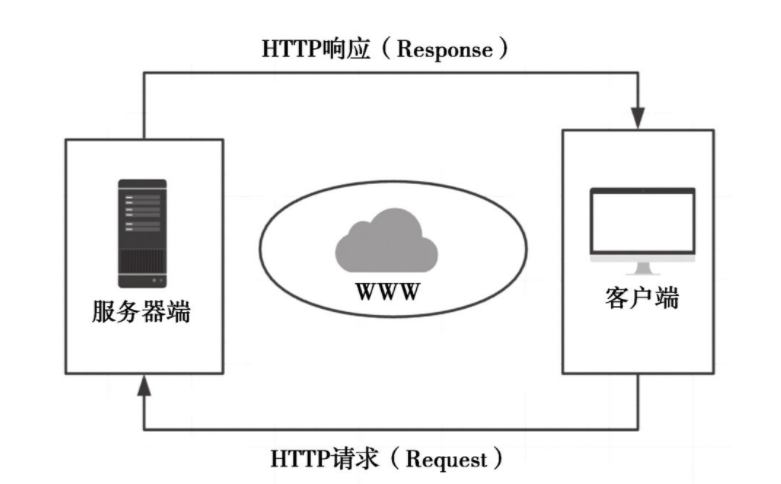

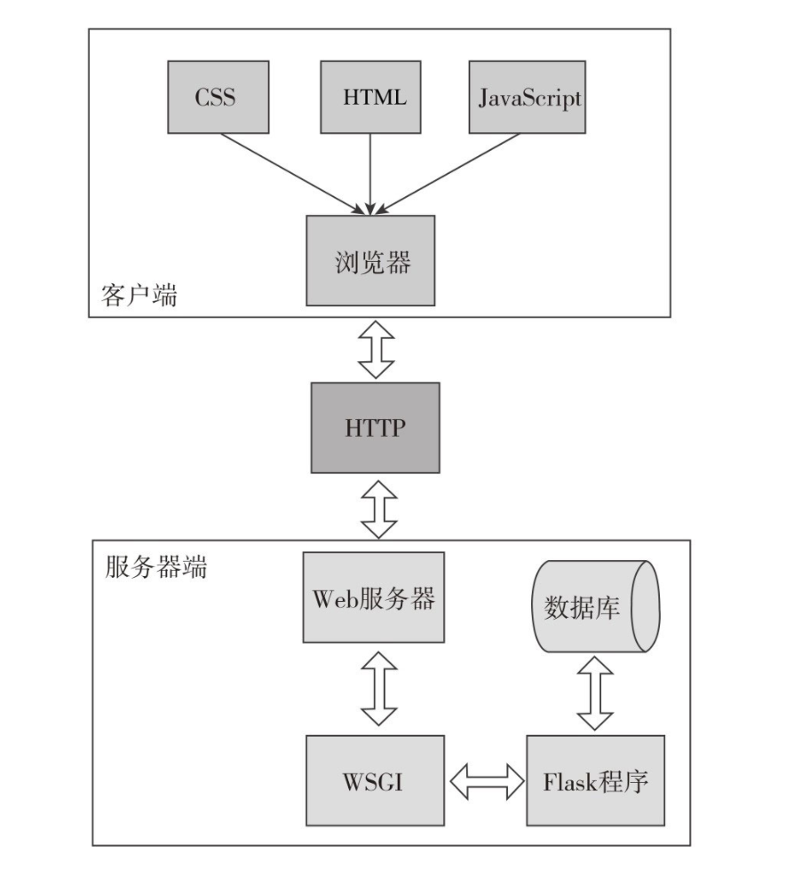

当用户访问一个URL，浏览器便生成对应的HTTP请求，经由互联网发送到对应的Web服务器。Web服务器接收请求，通过WSGI将HTTP格式的请求数据转换成Flask程序能够使用的Python数据。在程序中，Flask根据请求的URL执行对应的视图函数，获取返回值生成响应。响应依次经过wSGI转换生成HTTP响应，再经由Web服务器传递，最终被发出请求的客户端接收。浏览器渲染响应中包含的HTML和CSS代码，并执行Java Script代码，最终把解析后的页面呈现在用户浏览器的窗口中。

### URL组成

示例URL

```
http://helloflask.com/hello?name=Grey
```

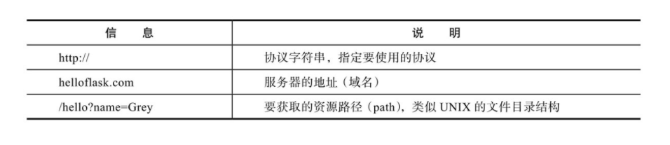

这个URL后面的?name=Grey部分是查询字符串( querystring)。URL中的查询字符串用来向指定的资源传递参数。查询字符串从问号?开始，以键值对的形式写出，多个键值对之间使用&分隔。

浏览器与服务器之间交互的数据被称为报文( message)，请求时浏览器发送的数据被称为请求报文( request message)，而服务器返回的数据被称为响应报文(response message) 。

### 请求类型

HTTP通过方法来区分不同的请求类型。当直接访问一个页面时，请求的方法是GET;当在某个页面填写了表单并提交时，请求方法则通常为POST。

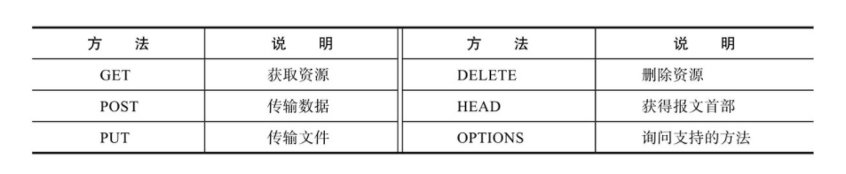

### request对象

Flask的请求对象request，这个请求对象封装了从客户端发来的请求报文，能从它获取请求报文中的所有数据。请求解析和响应封装实际上大部分是由Werkzeug完成的，Flask子类化Werkzeug的请求（Request)和响应(Response)对象并添加了和程序相关的特定功能。


示例URL

```
http://helloflask.com/hello?name=Grey
```

使用request对象属性获取请求URL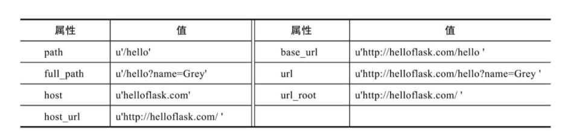

request对象常用的属性和方法

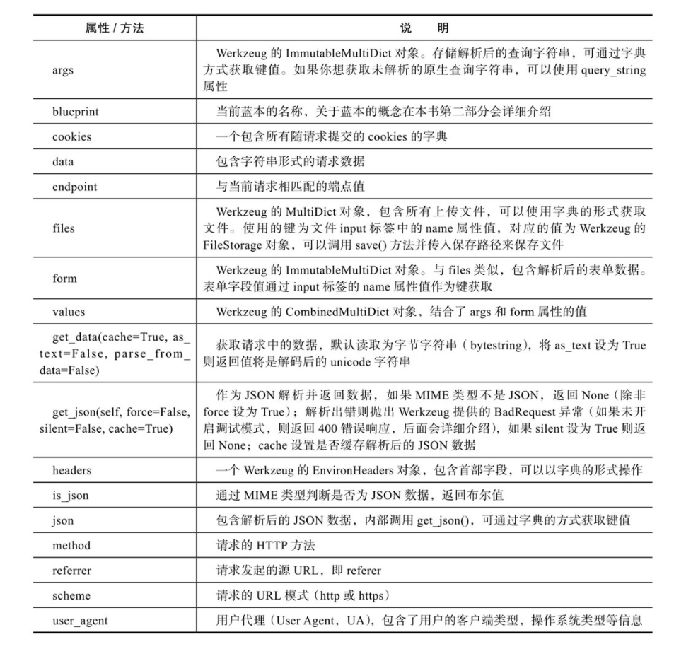

### Flask处理请求

当请求的URL与某个视图函数的URL规则匹配成功时，对应的视图函数就会被调用。使用flask routes命令可以查看程序中定义的所有路由，这个列表由app.url_map解析得到。

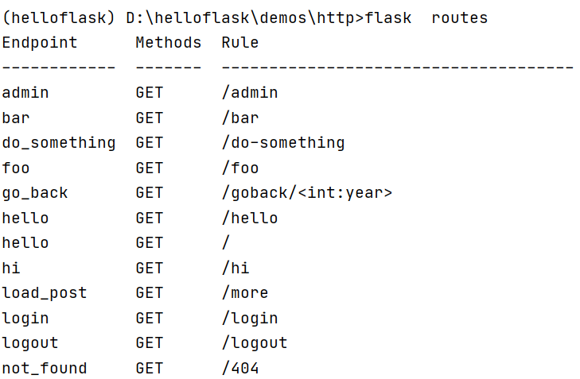

### 设置http监听方法

可以在app.route()装饰器中使用methods参数传入一个包含监听的HTTP方法的可迭代对象。比如，下面的视图函数同时监听GET请求和POST请求:

```
@app.route('/hi',methods=['GET','POST'])
def hi():
    return redirect(url_for('hello'))
```

### URL处理

URL规则中的变量部分有一些特别, <int:year>表示为year变量添加了一个int转换器，Flask在解析这个URL变量时会将其转换为整型。URL中的变量部分默认类型为字符串，但Flask提供了一些转换器可以在URL规则里使用。

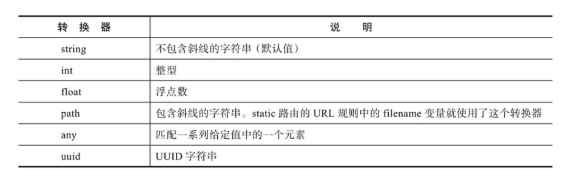

```python
#use int URL converter
@app.route('/goto/<int:year>')
def goto(year):
    return 'welcome to %d'%(2020+year)
```


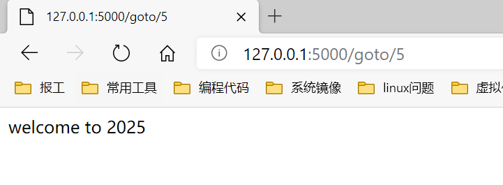

在用法上唯一特别的是any转换器，你需要在转换器后添加括号来给出可选值，即"<any(value1, value2，...):变量名>"。

```
@app.route('/colors/<any(blue, white, red):color>')
```

如果想要在any转换器中传入一个预先定义的列表，可以通过格式化字符串的方式（使用%或是format函数）来构建URL规则字符串。

```python
colors=['blue','white','dark','red','green','yellow']
@app.route('/colors/<any(%s):color>'%str(colors)[1:-1])
```

### 请求钩子

有时需要对请求进行预处理( preprocessing)和后处理( postprocessing)，这时可以使用Flask提供的一些请求钩子(Hook)，它们可以用来注册在请求处理的不同阶段执行的处理函数(或称为回调函数，即Callback)。这些请求钩子使用装饰器实现，通过程序实例app调用，用法很简单:以before_request钩子(请求之前)为例，当对一个函数附加了app.before_request装饰器后，就会将这个函数注册为before_request处理函数，每次执行请求前都会触发所有before_request处理函数。

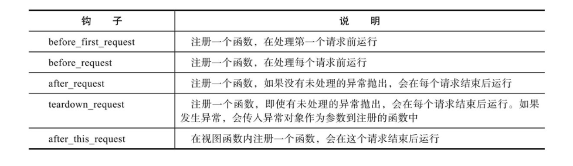

示例代码

```
@app.before_request
def do_something():
    return 'your request got!'
```

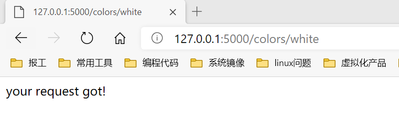

处理流程示意图

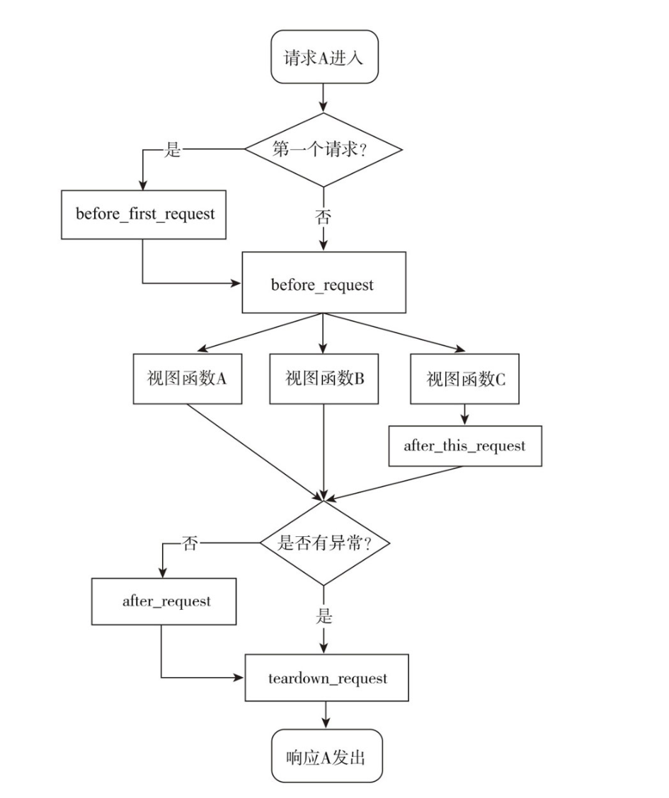

请求钩子常见应用场景：

before_first_request:在玩具程序中，运行程序前我们需要进行一些程序的初始化操作，比如创建数据库表，添加管理员用户。这些工作可以放到使用before_first_request装饰器注册的函数中。
before_request:比如网站上要记录用户最后在线的时间，可以通过用户最后发送的请求时间来实现。为了避免在每个视图函数都添加更新在线时间的代码，我们可以仅在使用before_request钩子注册的函数中调用这段代码。
after_request:我们经常在视图函数中进行数据库操作，比如更新、插入等，之后需要将更改提交到数据库中。提交更改的代码就可以放到after_request钩子注册的函数中。

另一种常见的应用是建立数据库连接，通常会有多个视图函数需要建立和关闭数据库连接，这些操作基本相同。一个理想的解决方法是在请求之前( before_request)建立连接，在请求之后(teardown_request)关闭连接。通过在使用相应的请求钩子注册的函数中添加代码就可以实现。这很像单元测试中的set Up()方法和tear Down()方法。

重要：after_request钩子和after_this_request钩子必须接收一个响应类对象作为参数，并且返回同一个或更新后的响应对象。

## http响应

响应报文主要由协议版本、状态码( status code)、原因短语( reason phrase) 、响应首部和响应主体组成。

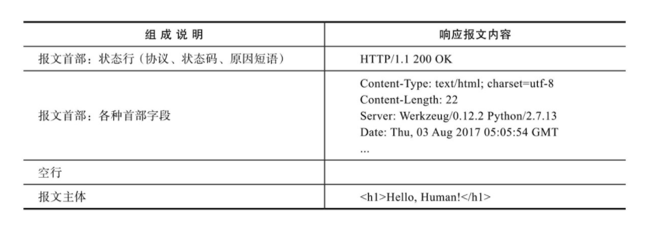

http状态码用来表示请求处理的结果

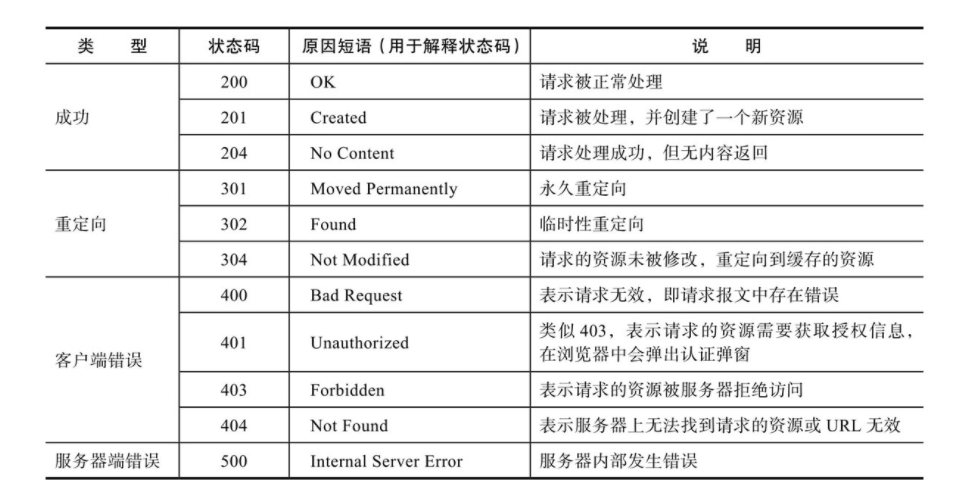

当关闭调试模式时，即FLASK_ENV使用默认值production，如果程序出错，Flask会自动返回500错误响应;而调试模式下则会显示调试信息和错误堆栈。

### 在Flask中生成响应

响应在Flask中使用response对象表示，响应报文中的大部分内容由服务器处理。Flask会先判断是否可以找到与请求URL相匹配的路由，如果没有则返回404响应。如果找到，则调用对应的视图函数，视图函数的返回值构成了响应报文的主体内容，正确返回时状态码默认为200。Flask会调用make_response()方法将视图函数返回值转换为响应对象。

完整地说，视图函数可以返回最多由三个元素组成的元组:响应主体、状态码、首部字段。其中首部字段可以为字典，或是两元素元组组成的列表。

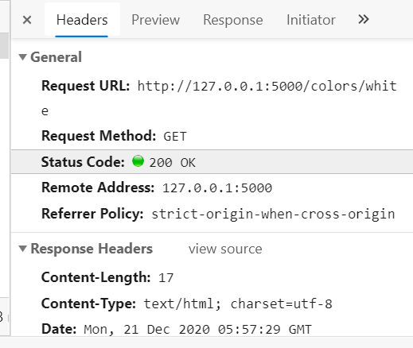

```
@app.route('/hi',methods=['GET','POST'])
def hi():
    return '',205
```

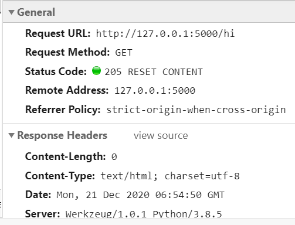

```
@app.route('/hi')
def hi():
    return '',302,'http://www.example.com'
```


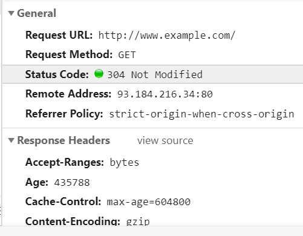

### 重定向

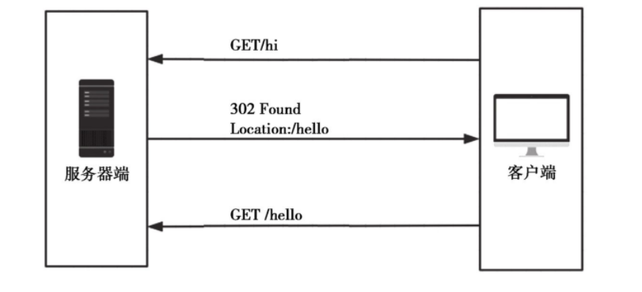

对于重定向这一类特殊响应，Flask提供了一些辅助函数。除了手动生成302响应，我们可以使用Flask提供的redirect()函数来生成重定向响应，重定向的目标URL作为第一个参数。

在Web程序中，我们经常需要进行重定向。比如，当某个用户在没有经过认证的情况下访问需要登录后才能访问的资源，程序通常会重定向到登录页面。

```
@app.route('/hi')
def hi():
    return redirect('http://www.example.com')
```

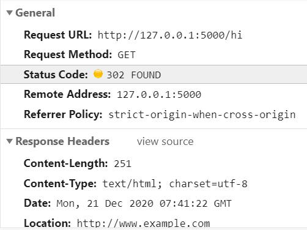

使用redirect()函数时，默认的状态码为302，即临时重定向。如果想修改状态码，可以在redirect()函数中作为第二个参数或使用code关键字传入。

如果要在程序内重定向到其他视图，那么只需在redirect()函数中使用url_for()函数生成目标URL即可。

```
@app.route('/hi')
def hi():
    return redirect(url_for('hello'))#重定向到“hello”
```

### 错误响应

大多数情况下，Flask会自动处理常见的错误响应。HTTP错误对应的异常类在Werkzeug的werkzeug.exceptions模块中定义，抛出这些异常即可返回对应的错误响应。如果你想手动返回错误响应，更方便的方法是使用Flask提供的abort()函数。

在abort()函数中传入状态码即可返回对应的错误响应。

```
@app.route('/404')
def not_found():
    abort(404)
```

abort()函数前不需要使用return语句，但一旦abort()函数被调用，abort()函数之后的代码将不会被执行。

#### 响应格式

通常使用HTML格式，不同格式需要不同的MIME类型，在首部Content-Type字段中定义。

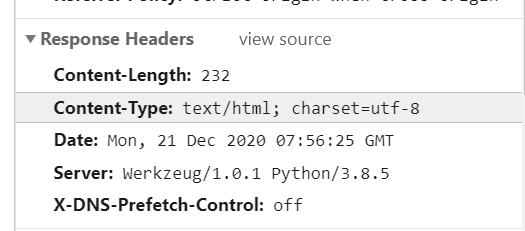

MIME类型(又称为media type或content type）是一种用来标识文件类型的机制，它与文件扩展名相对应，可以让客户端区分不同的内容类型，并执行不同的操作。一般的格式为“类型名/子类型名”，其中的子类型名一般为文件扩展名。比如，HTML的MIME类型为“text/html” , png图片的MIME类型为“image/png”。

如果想使用其他MIME类型，可以通过Flask提供的make_response()方法生成响应对象，传入响应的主体作为参数，然后使用响应对象的mimetype属性设置MIME类型。

```
@app.route('/test')
def test():
    response=make_response('this is a test')
    response.mimetype='text/plain'
    return response
```

常用的数据格式有纯文本、HTML、XML和JSON。

#### 纯文本

MIME类型:text/plain

事实上，其他几种格式本质上都是纯文本。比如同样是一行包含HTML标签的文本“<h1>Hello，Flask!</h1>”，当MIME类型设置为纯文本时，浏览器会以文本形式显示“<h1>Hello,Flask!</h1>” ;当MIME类型声明为text/html时，浏览器则会将其作为标题1样式的HTML代码渲染。

```
Note
to: Peter
from: Jane
heading: Reminder
body: Don't forget the party!
```

#### HTML

MIME类型:text/html

HTML ( https://www.w3.org/html/)指Hypertext MarkupLanguage(超文本标记语言)，是最常用的数据格式，也是Flask返回响应的默认数据类型。

```html
<! DOCTYPE html>
        <html>
        <head></head>
        <body>
            <h1>Note</h1>
            <p>to: Peter</p>
            <p>from: Jane</p>
            <p>heading: Reminder</p>
            <p>body: <strong>Don't forget the party! </strong></p>
        </body>
        </html>
```

因为HTML常常包含丰富的信息，可以直接将HTML嵌入页面中，处理起来比较方便。因此，在普通的HTTP请求中我们使用HTTP作为响应的内容，这也是默认的数据类型。

#### XML

MIME类型: application/xml

XML (https://www.w3.org/XML/)指Extensible MarkupLanguage(可扩展标记语言)，它是一种简单灵活的文本格式，被设计用来存储和交换数据。XML的出现主要就是为了弥补HTML的不足:对于仅仅需要数据的请求来说，HTML提供的信息太过丰富了，而且不易于重用。XML和HTML一样都是标记性语言，使用标签来定义文本，但HTML中的标签用于显示内容，而XML中的标签只用于定义数据。XML一般作为AJAX请求的响应格式，或是WebAPI的响应格式。

```xml
<? xml version="1.0" encoding="UTF-8"? >
        <note>
            <to>Peter</to>
            <from>Jane</from>
            <heading>Reminder</heading>
            <body>Don't forget the party! </body>
        </note>
```

#### JSON

MIME类型: application/json

JSON ( http://json.org/)指Java Script Object Notation ( JavaScript对象表示法)，是一种流行的、轻量的数据交换格式。它的出现又弥补了XML的诸多不足:XML有较高的重用性，但XML相对于其他文档格式来说体积稍大，处理和解析的速度较慢。JSON轻量，简洁，容易阅读和解析，而且能和Web默认的客户端语言JavaScript更好地兼容。JSON的结构基于“键值对的集合”和“有序的值列表”，这两种数据结构类似Python中的字典(dictionary)和列表( list)。正是因为这种通用的数据结构，使得JSON在同样基于这些结构的编程语言之间交换成为可能。

```json
	{
            "note":{
                "to":"Peter",
                "from":"Jane",
                "heading":"Remider",
                "body":"Don't forget the party! "
            }
        }
```

