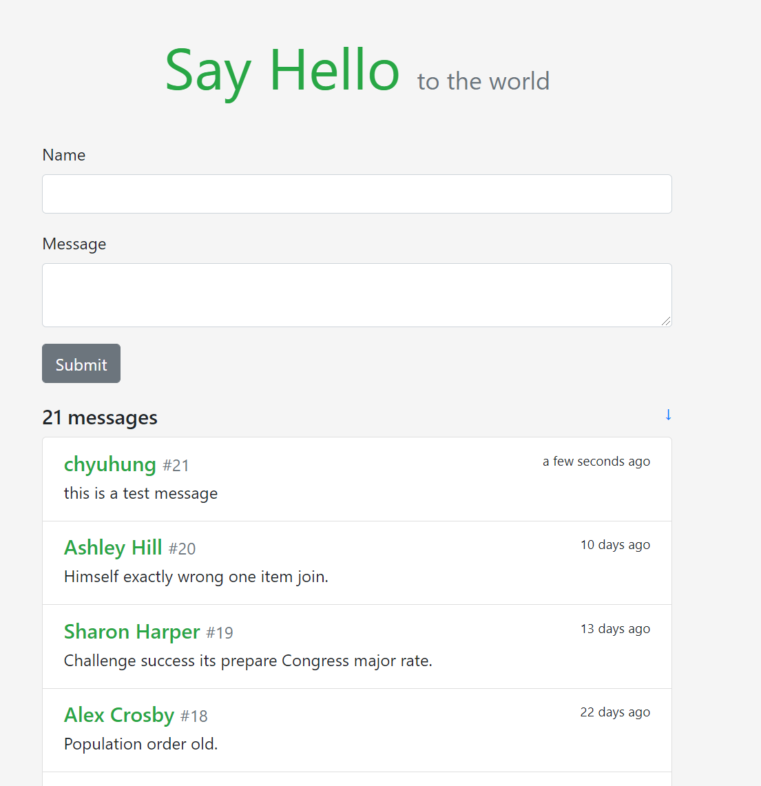
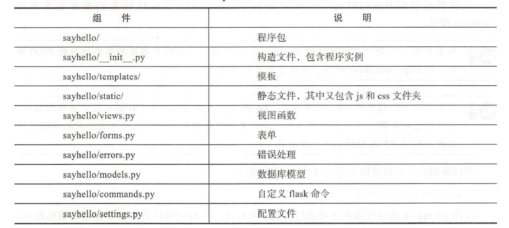

# flask实战进阶

## 留言板

克隆项目示例代码到本地：

```
CYH@LAPTOP-TENBN6L2 MINGW64 /d/flask项目
$ git clone https://github.com/greyli/sayhello.git
Cloning into 'sayhello'...
remote: Enumerating objects: 117, done.
remote: Counting objects: 100% (7/7), done.
remote: Compressing objects: 100% (7/7), done.
remote: Total 117 (delta 1), reused 1 (delta 0), pack-reused 110
Receiving objects: 100% (117/117), 542.19 KiB | 401.00 KiB/s, done.
Resolving deltas: 100% (40/40), done.
```

创建虚拟环境，安装开发依赖：

```
PS D:\flask项目\sayhello> pwd

Path
----
D:\flask项目\sayhello

Creating a virtualenv for this project...
Pipfile: D:\flask项目\sayhello\Pipfile
Using C:/Users/CYH/AppData/Local/Programs/Python/Python38-32/python.exe (3.8.5) to create virtualenv...
[=   ] Creating virtual environment...created virtual environment CPython3.8.5.final.0-32 in 3937ms
  creator CPython3Windows(dest=C:\Users\CYH\.virtualenvs\sayhello-mLYsGrv2, clear=False, no_vcs_ignore=False, global=False)
  seeder FromAppData(download=False, pip=bundle, setuptools=bundle, wheel=bundle, via=copy, app_data_dir=C:\Users\CYH\AppData\Local\pypa\virtualenv)
    added seed packages: pip==21.0.1, setuptools==53.0.0, wheel==0.36.2
  activators BashActivator,BatchActivator,FishActivator,PowerShellActivator,PythonActivator,XonshActivator

Successfully created virtual environment!
Virtualenv location: C:\Users\CYH\.virtualenvs\sayhello-mLYsGrv2
Installing dependencies from Pipfile.lock (b158df)...
  ================================ 19/19 - 00:00:49
To activate this project's virtualenv, run pipenv shell.
Alternatively, run a command inside the virtualenv with pipenv run.
```

创建虚拟数据（flask forge是生成虚拟数据的自定义命令）：

```
PS D:\flask项目\sayhello> pipenv shell
Launching subshell in virtual environment...
Windows PowerShell
版权所有 (C) Microsoft Corporation。保留所有权利。

尝试新的跨平台 PowerShell https://aka.ms/pscore6  

PS D:\flask项目\sayhello> flask forge
Working...
Created 20 fake messages.
PS D:\flask项目\sayhello> flask run
 * Serving Flask app "sayhello" (lazy loading)
 * Environment: development
 * Debug mode: on
 * Restarting with windowsapi reloader
 * Debugger is active!
 * Debugger PIN: 861-459-557
 * Running on http://127.0.0.1:5000/ (Press CTRL+C to quit)
```

预览项目效果：



### 使用包组织代码

当前程序包组件和结构



#### 配置文件

flask中，可以通过config对象写入，也可以在文件中读取，如使用setting.py或config.py，直接使用键值对的方式写出， 和环境变量的.flaskenv文件非常相似，示例setting.py:

```
# -*- coding: utf-8 -*-
import os
import sys

from sayhello import app

# SQLite URI compatible
WIN = sys.platform.startswith('win')
if WIN:
    prefix = 'sqlite:///'
else:
    prefix = 'sqlite:////'


dev_db = prefix + os.path.join(os.path.dirname(app.root_path), 'data.db')

SECRET_KEY = os.getenv('SECRET_KEY', 'secret string')
SQLALCHEMY_TRACK_MODIFICATIONS = False
SQLALCHEMY_DATABASE_URI = os.getenv('DATABASE_URI', dev_db)
```

上面的配置和第一部分的示例程序相比有一点变化，由于配置文件被放到了程序包内，为了定位到位于项目根目录的数据库文件，使用os.path.dirname(app.root_path)获取上层目录，app.root_path属性存储程序实例所在的路径。数据库URL和密钥都会首先从环境变量获取。
在创建程序实例后，使用config对象的from_pyfile()方法即可加载配置，传人配置模块的文件名作为参数:

```
...
app = Flask(_name_)
app.config.from_pyfile( 'settings.py ')
```

