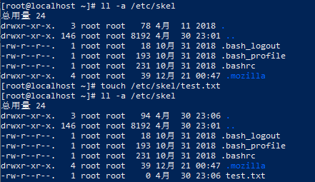

# 关于Linux的/etc/skel目录

skel（skeleton的缩写，意为骨骼、框架）是用来存放新用户配置文件的目录，当添加新用户时，这个目录下的所有文件会自动被复制到新添加的用户的家目录下。

默认情况下，/etc/skel目录下的所有文件都是隐藏文件（以.点开头的文件），通过修改、添加、删除/etc/skel目录下的文件，可以为新创建的用户提供统一、标准的、初始化用户环境。

已下通过测试案例了解skel目录下文件的作用：

1、在/etc/skel目录下新增测试文本

2、创建新的用户cyh，该测试文本被系统自动复制到了用户目录下

.png)

3、模拟删除用户目录下的文件

.png)

4、切换到cyh用户，出现这样的情况表明用户目录下的文件没有了

.png)

5、从/etc/skel中复制文件进行恢复，再切换用户后正常

.png)

6、部分系统中必须赋予用户文件的权限

.png)