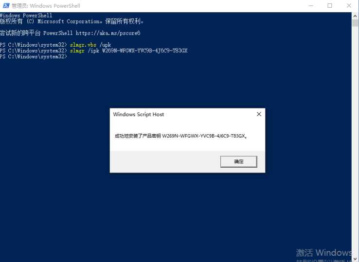
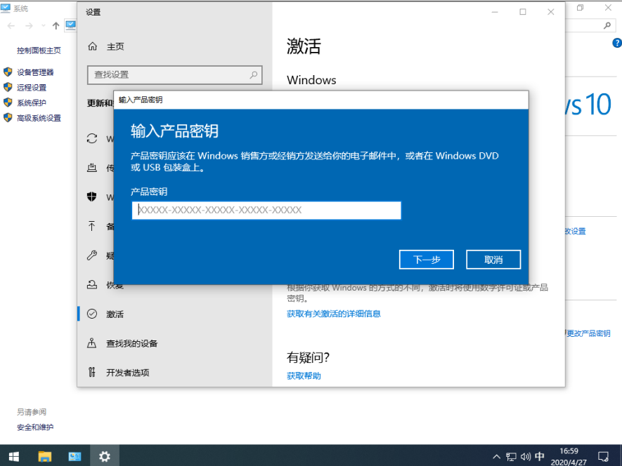
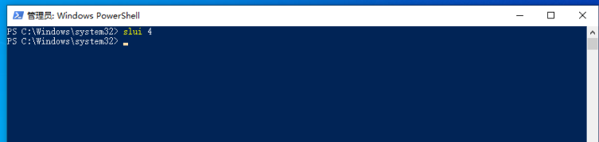
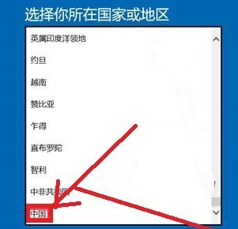
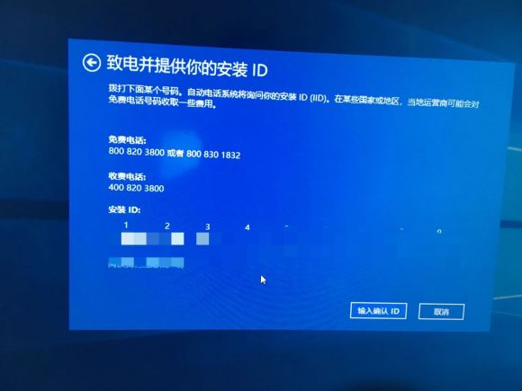

# WindowsServer电话激活操作步骤

1、使用命令`slmgr /ipk [密钥]`导入与系统相符的密钥，或在系统激活界面选择更改密钥，输入相应的密钥，否则无法调出电话激活界面

2、输入命令`slui 4`调出电话激活界面

3、在界面中选择“中国”并下一步

4、按正常程序拨打电话进行激活即可

附：微软电话激活拨号步骤

# WindowsServer电话激活拨号步骤

1）拨打微软客服电话400 820 3800

2）电话提示产品激活，请拨5

3）电话提示普通话，请按1

4）电话提示如果需要如果需要激活的windows server由零售店购买或已安装在您的电脑，请拨1

5）如果您正尝试Windows10，请按2

6）电话提示请准备好安装ID，如果已看到安装ID，请按1 ，然后输入产品安装ID，记录下产品激活ID并输入后即可激活