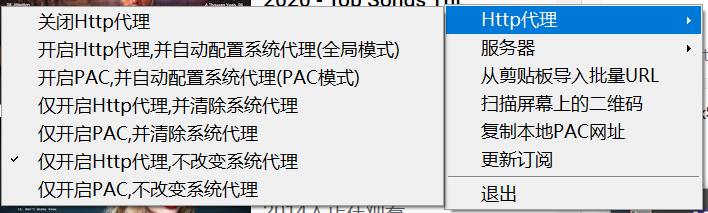
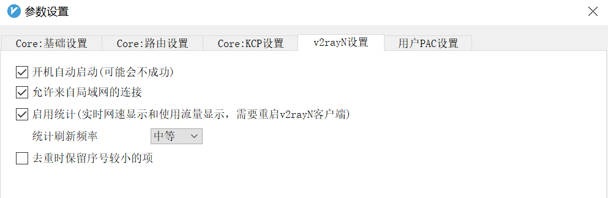
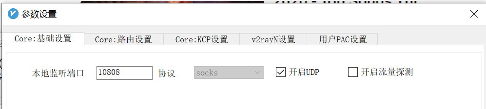
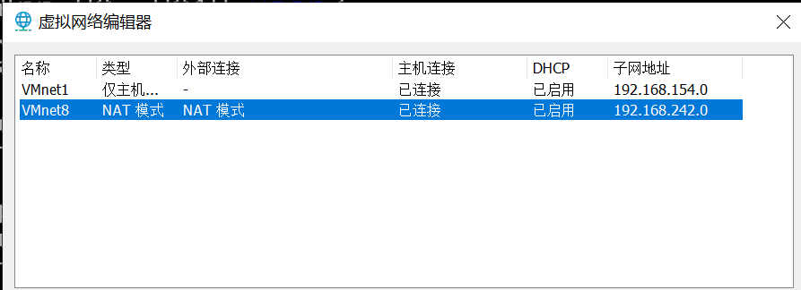
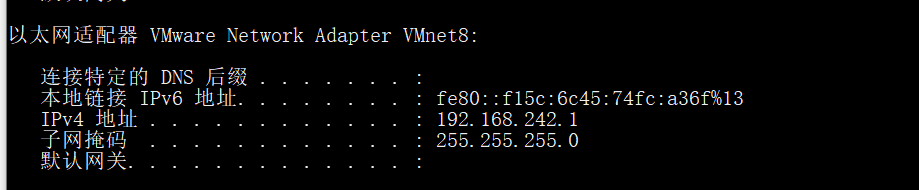
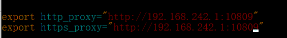

# 为Vmware-Workstation中的Ubuntu虚拟机配置V2ray代理

## 本地V2ray必要配置

1、开启V2ray代理

2、允许来自局域网的连接

3、确认本地监听端口，如10808

## Vmware-Workstation配置

1、虚拟机网络类型选择NAT模式

2、本地主机运行`ipconfig`查看与虚拟机同网段的地址，如192.168.242.1（非网关地址）

## 虚拟机网络配置

1、配置代理，使用命令`vi ~/.bashrc`，添加配置到文件末尾，端口对应V2ray本地监听端口+1，如：

`export http_proxy="http://192.168.242.1:10809"`
`export https_proxy="http://192.168.242.1:10809"`

2、使用命令 `source ~/.bashrc`使配置文件立即生效

3、以上两步配置仅对当前用户有效，切换用户环境变量后可以使用同样的步骤进行配置