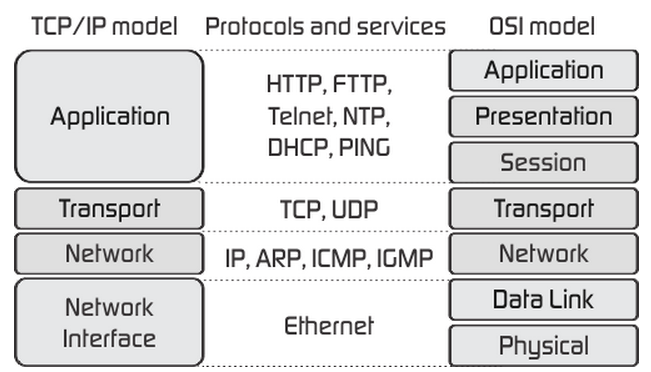

# TCP/IP协议

## 产生背景

Intetnet网络前身ARPANET（ARPA：美国高级研究计划署简称，ARPANET也称阿帕网）开始使用的是*网络控制协议*（Network Control Protocol，NCP），随着网络和用户的不断发展，NCP仅能用于同构环境中（所谓同构环境是网络上的所有计算机都运行相同的操作系统）的缺陷愈发凸显，设计者就认为“同构”这一限制不应被加到一个分布广泛的网络上，于是，用于“异构”网络环境中的*传输控制协议/网际协议协议*（Transmission Control Protocol/Internet Protocol，TCP/IP）应运而生。

## 协议组成

TCP/IP协议在一定程度上参考了[OSI](https://baike.baidu.com/item/OSI/5520)的体系结构。OSI模型共有七层，从下到上分别是物理层、数据链路层、网络层、运输层、会话层、表示层和应用层。但是这显然是有些复杂的，所以在TCP/IP协议中，它们被简化为了四个层次。

（1）应用层、表示层、会话层三个层次提供的服务相差不是很大，所以在TCP/IP协议中，它们被合并为应用层一个层次。

（2）由于运输层和网络层在网络协议中的地位十分重要，所以在TCP/IP协议中它们被作为独立的两个层次。

（3）因为数据链路层和物理层的内容相差不多，所以在TCP/IP协议中它们被归并在网络接口层一个层次里。只有四层体系结构的TCP/IP协议，与有七层体系结构的OSI相比要简单了不少，也正是这样，TCP/IP协议在实际的应用中效率更高，成本更低。

## 通信过程及相关协议

在[网络通信](https://baike.baidu.com/item/网络通信/9636548)的过程中，将发出数据的主机称为源主机，接收数据的主机称为目的主机。当源主机发出数据时，数据在源主机中从上层向下层传送。源主机中的应用进程先将数据交给应用层，应用层加上必要的控制信息就成了报文流，向下传给传输层。传输层将收到的数据单元加上本层的控制信息，形成报文段、数据报，再交给网际层。网际层加上本层的控制信息，形成IP数据报，传给网络接口层。网络接口层将网际层交下来的IP数据报组装成帧，并以比特流的形式传给网络硬件（即物理层），数据就离开源主机。

### 链路层

以太网协议规定，接入网络的设备都必须安装网络适配器，即[网卡](https://baike.baidu.com/item/网卡/155684)，数据包必须是从一块网卡传送到另一块网卡。而网卡地址就是数据包的发送地址和接收地址，有了MAC地址以后，[以太网](https://baike.baidu.com/item/以太网/99684)采用广播形式，把数据包发给该子网内所有主机，子网内每台主机在接收到这个包以后，都会读取首部里的目标MAC地址，然后和自己的MAC地址进行对比，如果相同就做下一步处理，如果不同，就丢弃这个包。

**所以链路层的主要工作就是对电信号进行分组并形成具有特定意义的数据帧，然后以广播的形式通过物理介质发送给接收方。**

### 网络层

#### IP协议

网络层引入了IP协议，制定了一套新地址，使得我们能够区分两台主机是否同属一个网络，这套地址就是网络地址，也就是所谓的IP地址。IP协议将这个32位的地址分为两部分，前面部分代表网络地址，后面部分表示该主机在局域网中的地址。如果两个IP地址在同一个子网内，则网络地址一定相同。为了判断IP地址中的网络地址，IP协议还引入了子网掩码，IP地址和子网掩码通过按位与运算后就可以得到网络地址。

#### ARP协议

即地址解析协议，是根据IP地址获取MAC地址的一个网络层协议。其工作原理如下：ARP首先会发起一个请求数据包，数据包的首部包含了目标主机的IP地址，然后这个数据包会在链路层进行再次包装，生成以太网数据包，最终由以太网广播给子网内的所有主机，每一台主机都会接收到这个数据包，并取出标头里的IP地址，然后和自己的IP地址进行比较，如果相同就返回自己的MAC地址，如果不同就丢弃该数据包。ARP接收返回消息，以此确定目标机的MAC地址；与此同时，ARP还会将返回的MAC地址与对应的IP地址存入本机ARP缓存中并保留一定时间，下次请求时直接查询ARP缓存以节约资源。

#### ICMP

ICMP（Internet Control Message Protocol）Internet控制报文协议。它是TCP/IP协议簇的一个子协议，用于在IP主机、路由器之间传递控制消息。控制消息是指网络通不通、主机是否可达、路由是否可用等网络本身的消息。这些控制消息虽然并不传输用户数据，但是对于用户数据的传递起着重要的作用。ping 和 tracert是两个常用网络管理命令，ping 用来测试网络可达性，tracert 用来显示到达目的主机的路径。ping和 tracert 都利用 ICMP 协议来实现网络功能，它们是把网络协议应用到日常网络管理的典型实例。

#### 路由协议

首先通过IP协议来判断两台主机是否在同一个[子网](https://baike.baidu.com/item/子网/1186929)中，如果在同一个子网，就通过ARP协议查询对应的MAC地址，然后以广播的形式向该子网内的主机发送数据包；如果不在同一个子网，以太网会将该数据包转发给本子网的网关进行路由。网关是互联网上子网与子网之间的桥梁，所以网关会进行多次转发，最终将该数据包转发到目标IP所在的子网中，然后再通过ARP获取目标机MAC，最终也是通过广播形式将数据包发送给接收方。而完成这个路由协议的物理设备就是路由器，路由器扮演着交通枢纽的角色，它会根据信道情况，选择并设定路由，以最佳路径来转发数据包。

**所以，网络层的主要工作是定义网络地址、区分网段、子网内MAC寻址、对于不同子网的数据包进行路由。**

### 传输层

#### UDP协议

UDP协议定义了端口，同一个主机上的每个应用程序都需要指定唯一的端口号，并且规定网络中传输的数据包必须加上端口信息，当数据包到达主机以后，就可以根据端口号找到对应的应用程序了。UDP协议比较简单，实现容易，但它没有确认机制，数据包一旦发出，无法知道对方是否收到，因此可靠性较差，为了解决这个问题，提高网络可靠性，TCP协议就诞生了。

#### TCP协议

TCP即传输控制协议，是一种面向连接的、可靠的、基于字节流的通信协议。简单来说TCP就是有确认机制的UDP协议，每发出一个数据包都要求确认，如果有一个数据包丢失，就收不到确认，发送方就必须重发这个数据包。为了保证传输的可靠性，TCP协议在UDP基础之上建立了三次对话的确认机制，即在正式收发数据前，必须和对方建立可靠的连接。TCP数据包和UDP一样，都是由首部和数据两部分组成，唯一不同的是，TCP数据包没有长度限制，理论上可以无限长，但是为了保证网络的效率，通常TCP数据包的长度不会超过IP数据包的长度，以确保单个TCP数据包不必再分割。

**传输层的主要工作是定义[端口](https://baike.baidu.com/item/端口/103505)，标识应用程序身份，实现端口到端口的通信，TCP协议可以保证数据传输的可靠性。**

### 应用层

理论上讲，有了以上三层协议的支持，数据已经可以从一个主机上的应用程序传输到另一台主机的应用程序了，但此时传过来的数据是字节流，不能很好的被程序识别，操作性差，因此，应用层定义了各种各样的协议来规范数据格式，常见的有[http](https://baike.baidu.com/item/http/243074),[ftp](https://baike.baidu.com/item/FTP%E5%8D%8F%E8%AE%AE/7651119?fr=aladdin),[smtp](https://baike.baidu.com/item/smtp/175887)等，在请求[Header](https://baike.baidu.com/item/Header/688992)中，分别定义了请求数据格式Accept和响应数据格式Content-Type，有了这个规范以后，当对方接收到请求以后就知道该用什么格式来解析，然后对请求进行处理，最后按照请求方要求的格式将数据返回，请求端接收到响应后，就按照规定的格式进行解读。

**所以应用层的主要工作就是定义数据格式并按照对应的格式解读数据。**