# Windows实现自动连接VPN

## 1、系统环境

版本：Windows 10 企业版

版本号：1903

操作系统版本：18362.657

## 2、了解rasdial命令

1、首先配置好你的VPN，如：sitech，配置完成后点击桌面网络图标会出现VPN符号

2、按Windows+r运行cmd，输入连接VPN的命令：

`rasdial [VPN名称] [VPN账户] [VPN密码]`

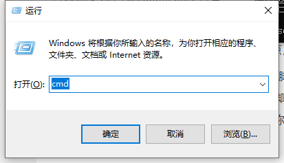

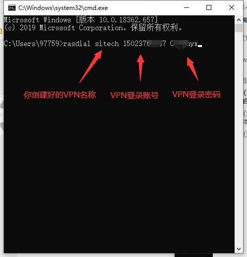

3、运行以后，可以看到提示已连接，同时查看网络连接处的VPN符号显示已连接

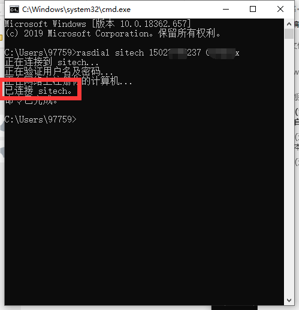

## 3、创建定时任务运行命令

1、在开始菜单中找到任务计划程序

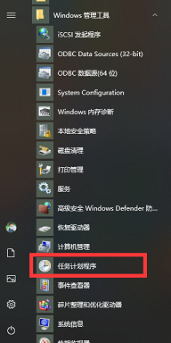

2、在右侧找到创建任务

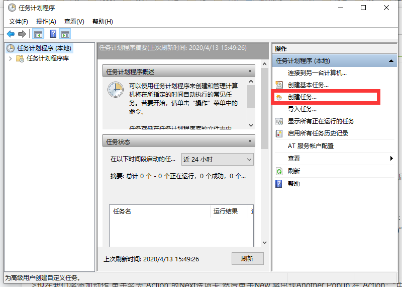

3、取一个别致的名称，加上帅气的描述，注意勾选最高权限运行

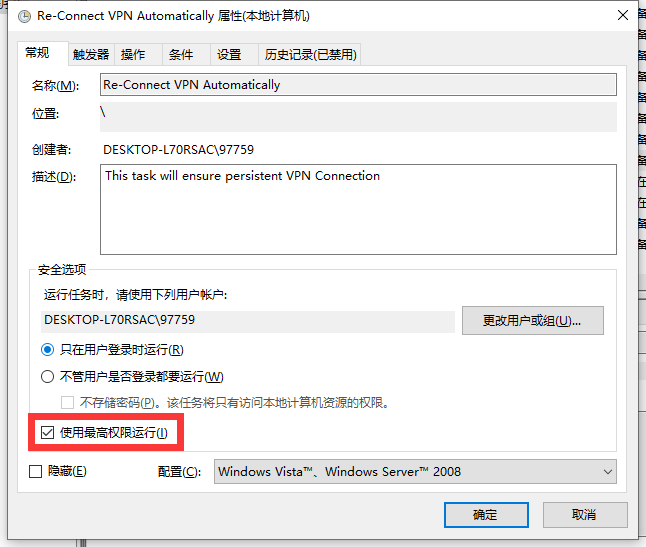

4、新增一个触发器，开始任务选择发生事件时，日志选择应用程序，源选择Rasclient，事件ID为20226（该事件为：以进行名为XXX的拨号连接，该连接已终止。）

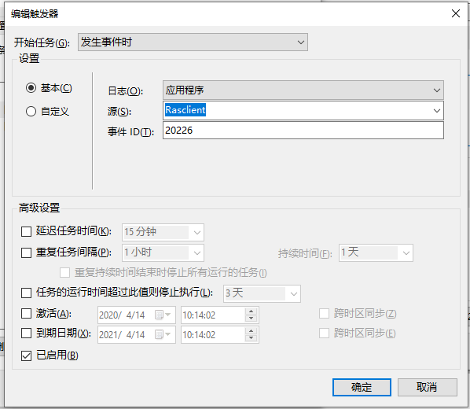

5、点击确认后再次新建触发器，开始任务选择发生事件时，日志选择Microsoft-Windows-NetworkProfile/Operational，源选择NetworkProfile，事件ID填写10000

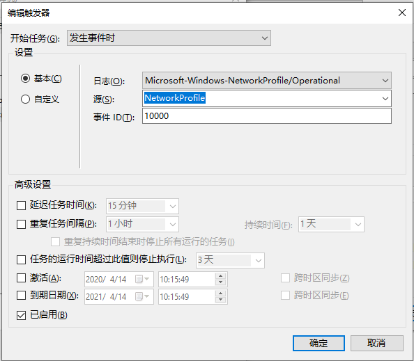

6、点击确认后再再次新建触发器，开始任务选择发生事件时，日志选择Microsoft-Windows-WLAN-AutoConfig/Operational，源选择WLAN-AutoConfig，事件ID填写8001（该事件为：WLAN 自动配置服务已成功连接到无线网络。）

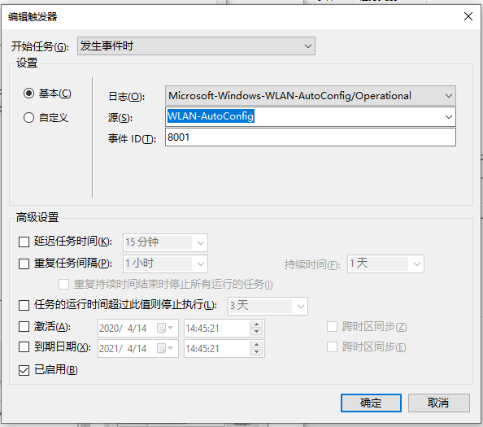

7、新建操作，选择启动程序，程序和脚本中浏览文件找到C:\Windows\System32\rasdial.exe，在参数中输入你的VPN名称，账户和密码，空格分隔

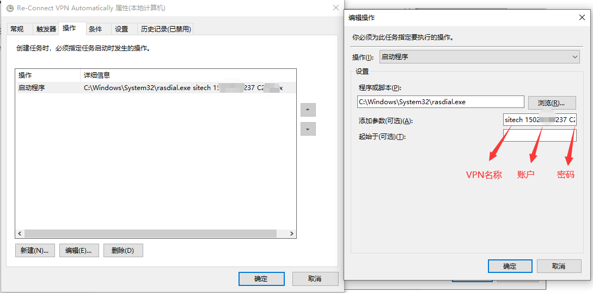

8、依次点击确认保存后关闭窗口，现在无论任何方式断开VPN后都会自动连接。此外，选项配置中的其他条件设置可依据个人电脑情况和使用习惯进行调整。

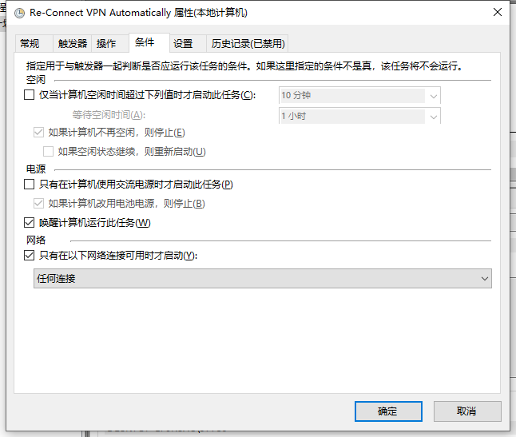

## 4、将路由配置脚本同时加入

1、针对易信VPN，完成前面的配置以后，每次连接后还需要手动运行添加路由的脚本，为解决这一问题，可以将脚本加入该定时任务中

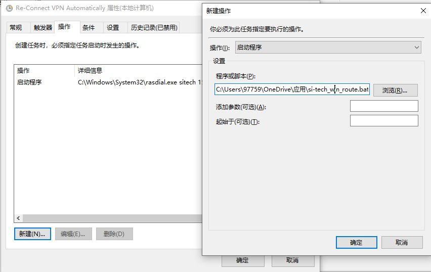

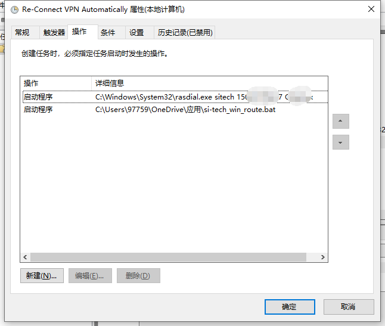

## 5、其他

1、如果你的脚本显示为乱码，可将脚本另存，编码选择ANSI

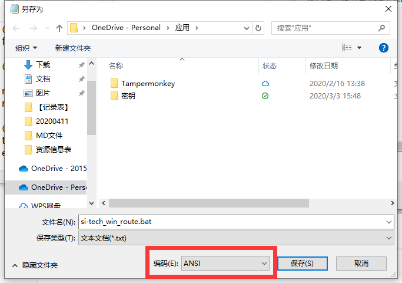

2、如果你登录易信门户依旧提示需要安全网关，（使用[Chromium](https://www.chromium.org/)内核的浏览器）按F12，将源代码选项中标记位置的==改为!=，按ctrl+s保存后再点击登录即可正常登录（此方法可临时解决）

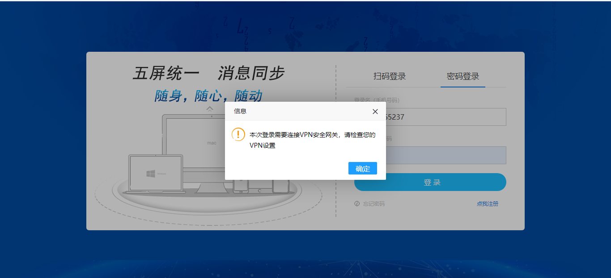

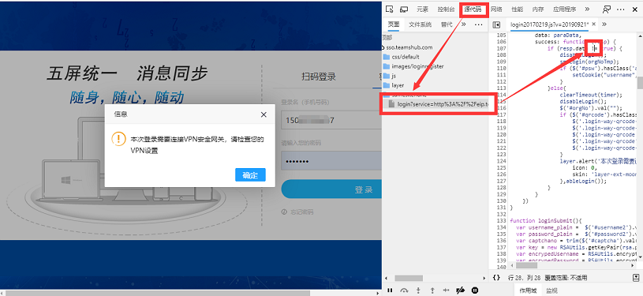