# 使用Hyper-V创建虚拟机

## 一、系统环境

版本：Windows 10 企业版

版本号：1903

操作系统版本：18362.657

## 二、Hyper-V启动和管理

在 Windows控制面板的程序和功能中，勾选启用Hyper-V后重启操作系统

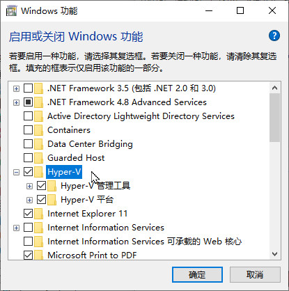

在Windows管理工具中打开Hyper-V管理器

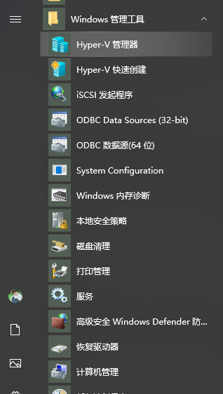

点击右侧的连接到服务器

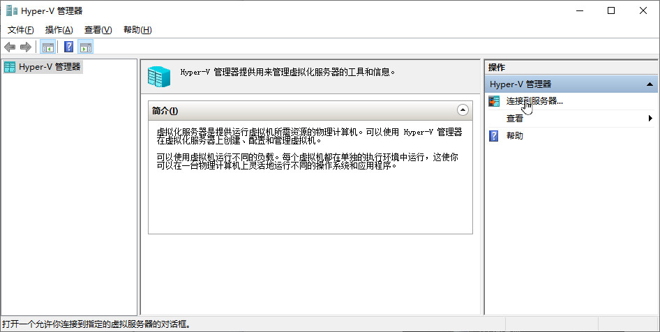

选择本地计算机

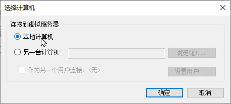

## 三、为连接外部网络准备

为了能让虚拟机联网，先要设置一下Hyper-V的网络，点击虚拟交换机管理器

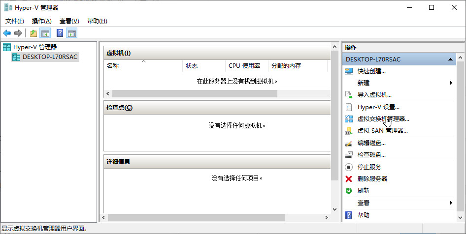

点击左侧新建虚拟网络交换机，选择外部后点击创建虚拟交换机

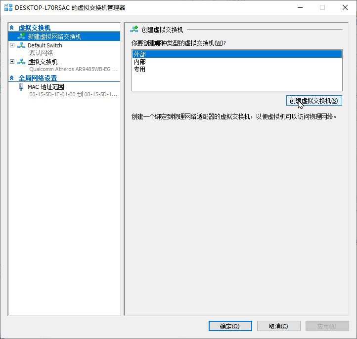

更改名称后选择外部网络连接类型，选择主机的物理网卡

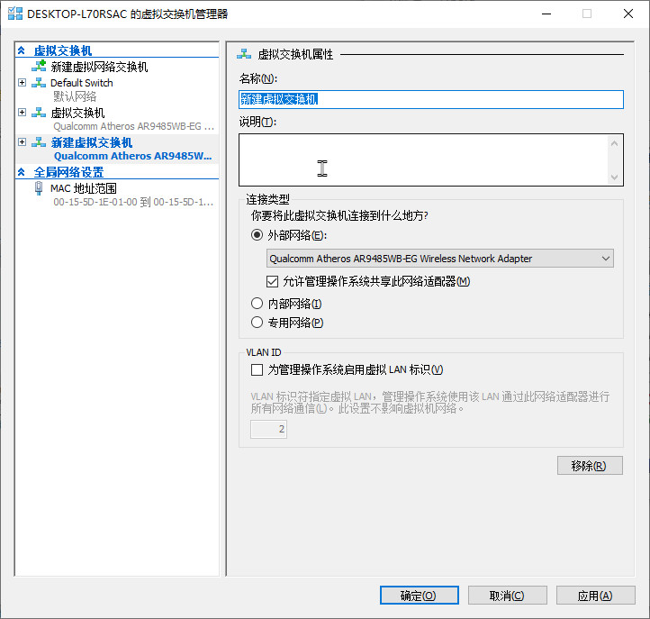

## 四、创建虚拟机

点击新建，选择虚拟机

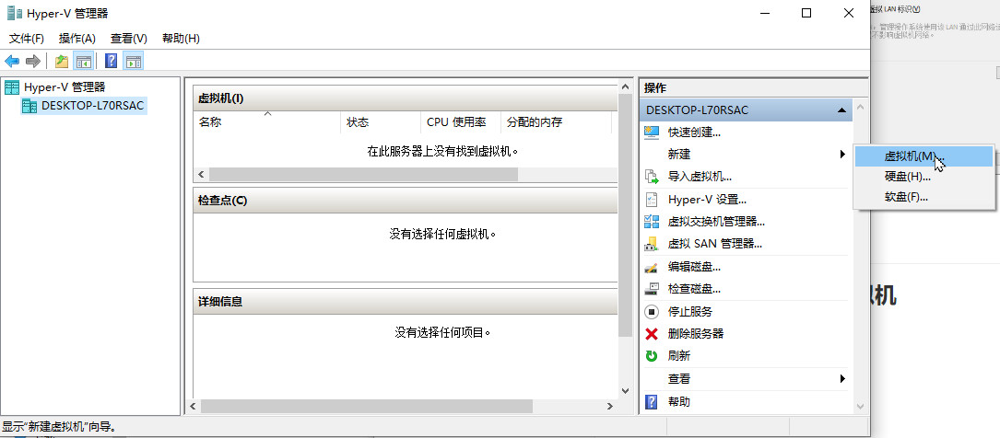

选择下一步

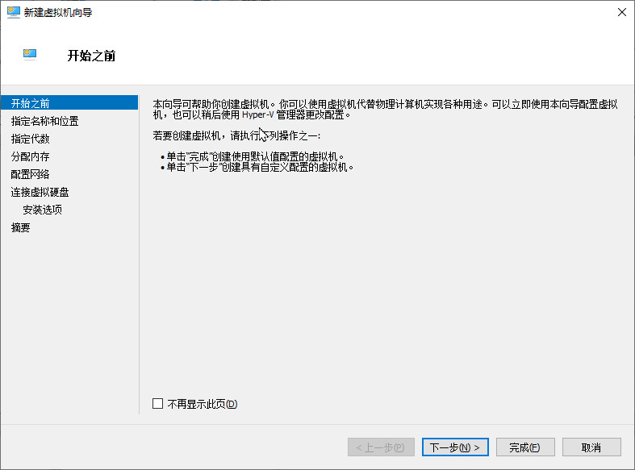

根据需要更改名称和存储位置

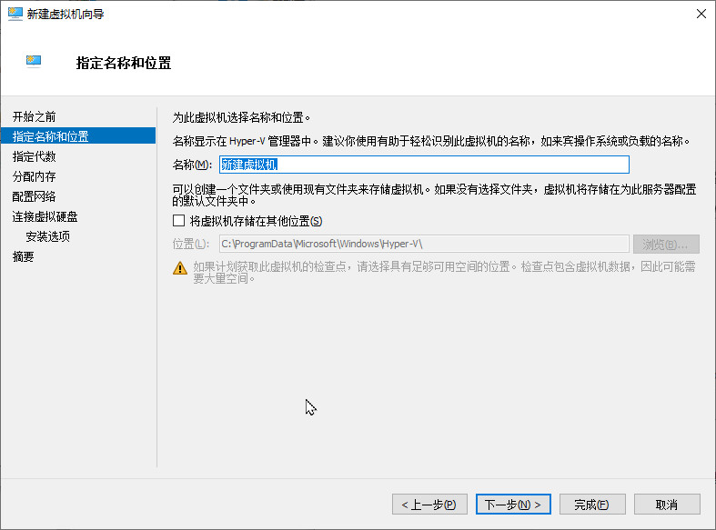

选择第一代

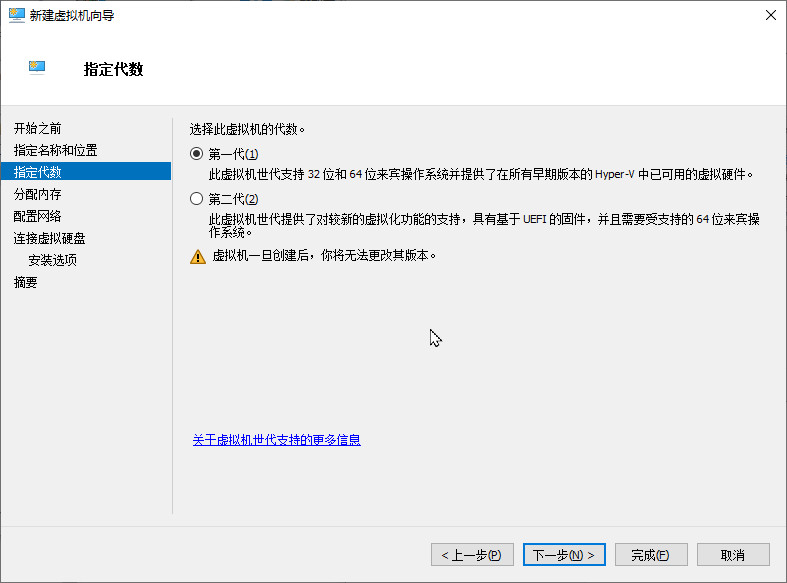

根据操作系统设置启动内存，通常Windows系统需求更大，取消勾选动态内存

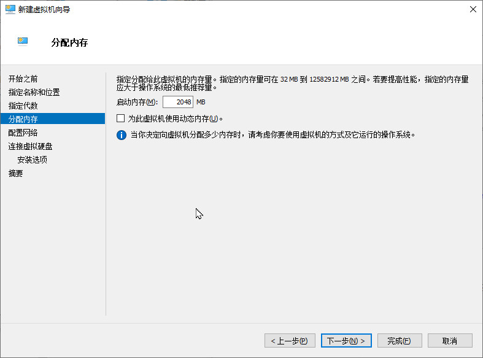

选择创建好的虚拟交换机

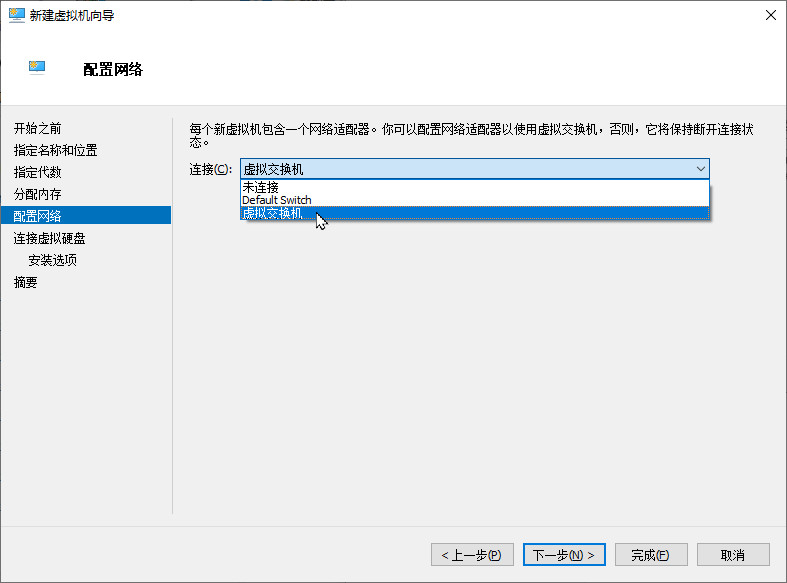

### 1、从VHDX格式创建虚拟机

选择使用现有的虚拟硬盘，选择已有的VHDX格式系统磁盘

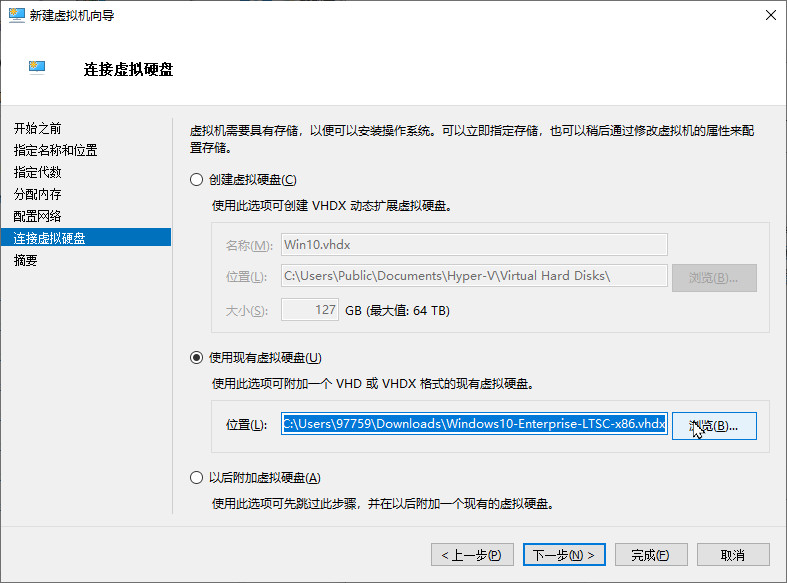

点击完成创建

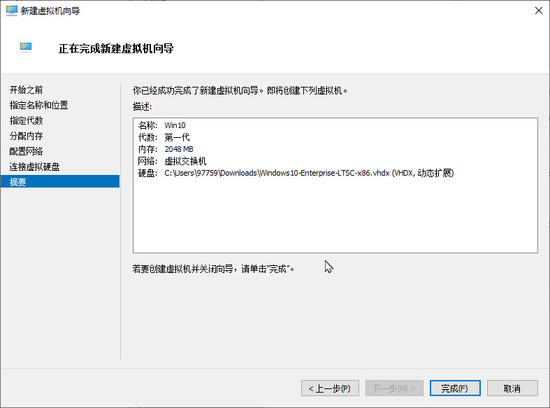

### 2、从ISO格式创建虚拟机

选择创建虚拟机硬盘

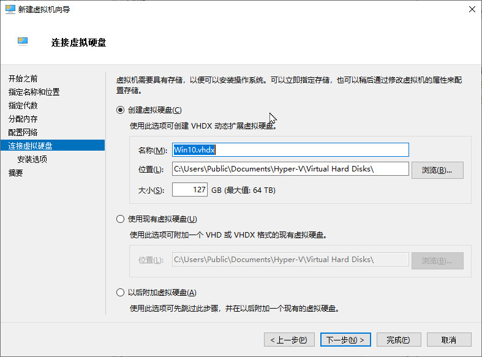

选择系统ISO文件

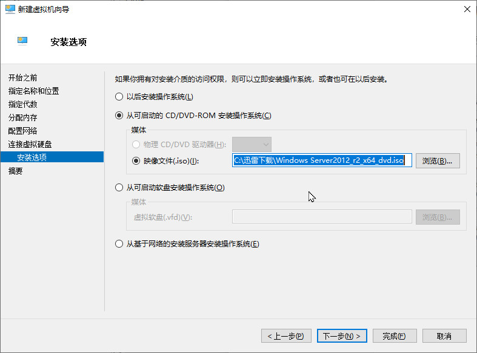

点击完成创建

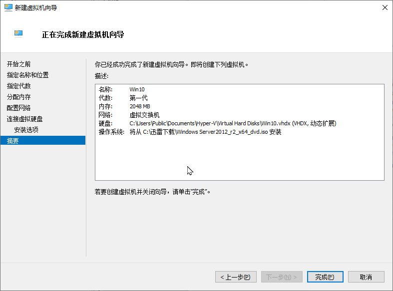

## 五、虚拟机启动和连接

右键创建好的虚拟机，点击启动

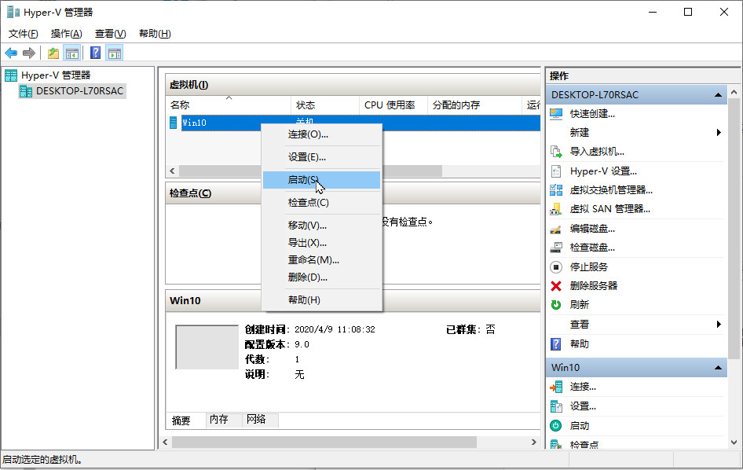

虚拟机启动后右键进行连接

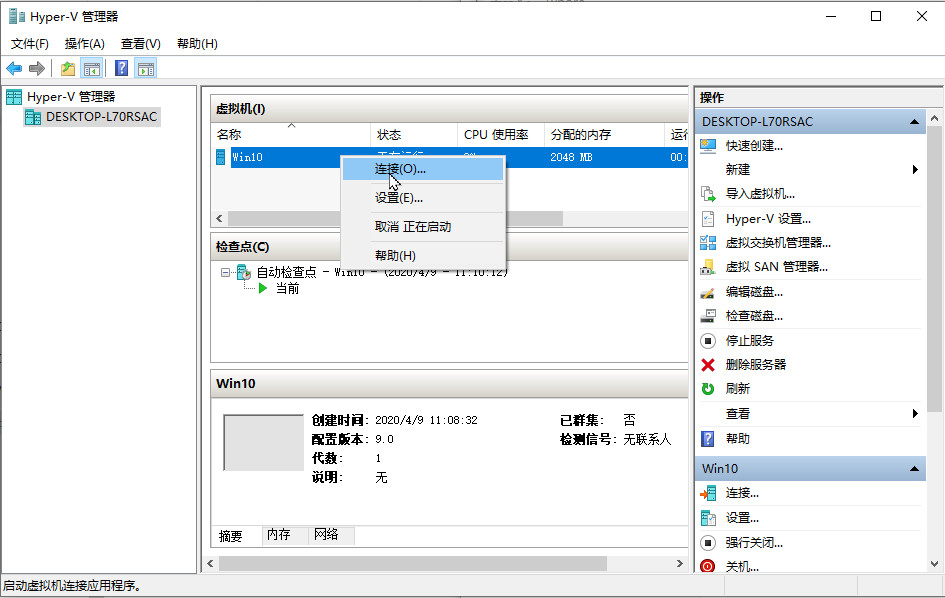

选择合适的分辨率进行连接

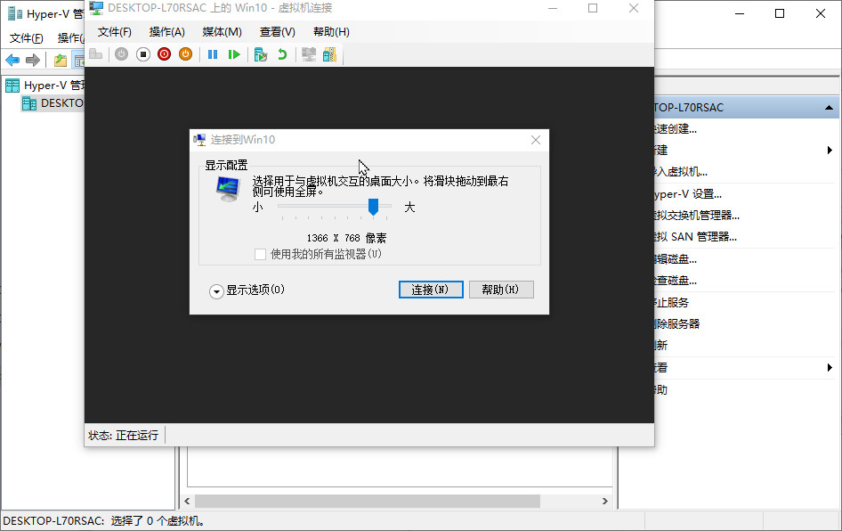

（从ISO进行创建的系统会进入系统安装流程，安装配置重启后）虚拟机创建启动完成

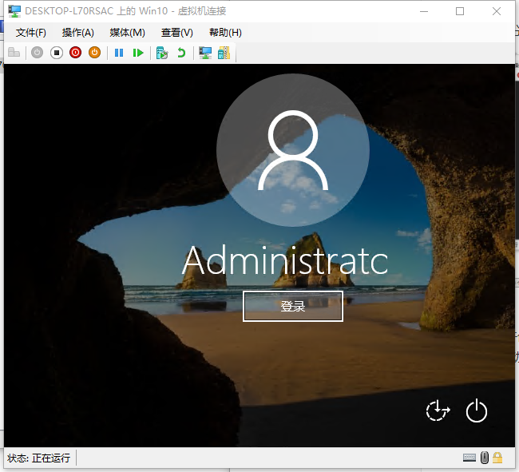

