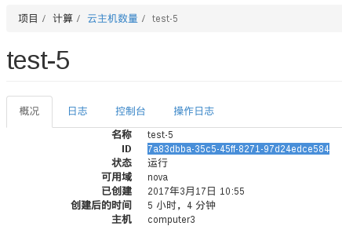
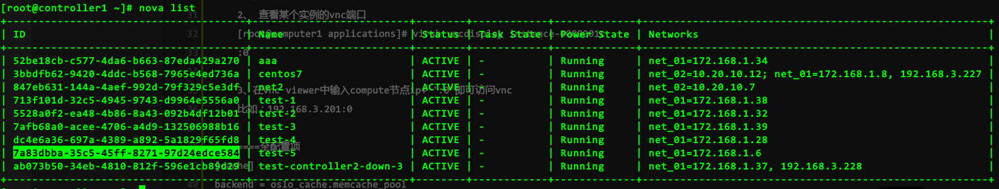
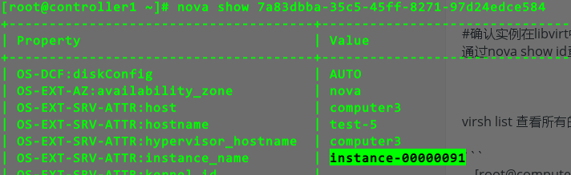
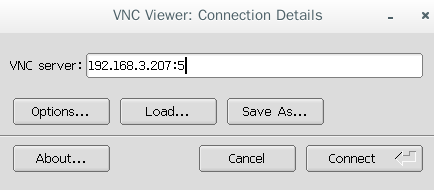

# 使用用vnc客户端连接虚拟机实例

1、确认实例ID，通过页面或者nova list命令查到要查看的实例的ID





2、确认实例在libvirt中的名称 通过nova show id查看实例在libvirt中的名称



3、确认实例的vnc端口 ssh到compute节点，通过如下命令确认实例的vnc端口

```bash
[root@computer3 ~]# virsh vncdisplay instance-00000091
:5
```

4、在vnc viewer中输入compute节点ip+[实例端口号] 即可访问vnc，比如：192.168.3.207:5

